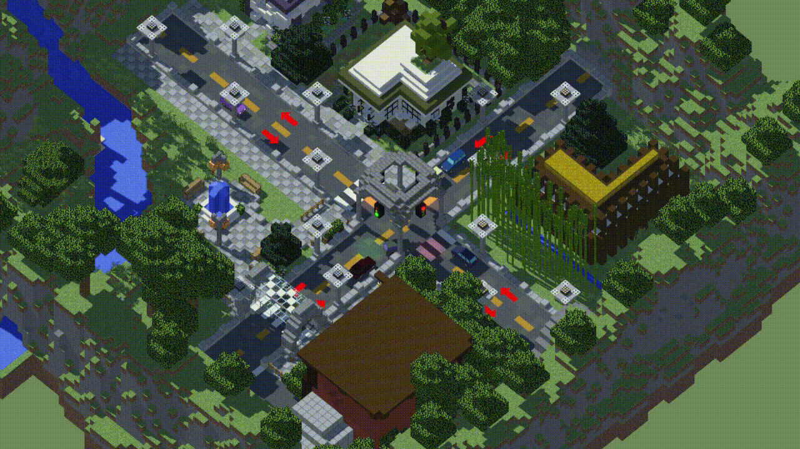

# Simulação de Trânsito Inteligente — Protótipo

	

Esse programa foi criado em 2022 como uma atividade complementar interdisciplinar do 3º ano do ensino médio, apresentado para as disciplinas de Geografia, 
História, Sociologia, Filosofia, Matemática, Química, Inglês, Português, Biologia e Física.
 
## Descrição

A proposta dessa atividade era solucionar um problema de mobilidade urbana regional, sendo inclusa a elaboração de um projeto e um protótipo da ideia proposta pelo grupo. A problemática escolhida foi o intenso congestionamento em ruas e avenidas, sendo indicada para sua resolução a criação de um sistema de trânsito inteligente.

O objetivo desse sistema é diminuir o tempo de espera nos semáforos baseando-se na quantidade de veículos parados em frente ao sinal. Em decorrência disso, é esperada a diminuiçao do estresse que muitos motoristas passam no trânsito, além de reduzir a emissão de gases poluentes.

## Como funciona

A simulação ocorre em um cruzamento, sendo que cada rua têm uma frequência de veículos específica e constante. Ela têm dois modos: o modo normal e o modo inteligente. No modo normal, todos os semáforos demoram a mesma quantidade de tempo para abrir e fechar. Quando um semáforo fecha, o próximo abre, fazendo um ciclo em sentido anti-horário.

No modo inteligente, porém, não é usado uma quantidade de tempo fixa para abrir e fechar os semáforos. É aberto o semáforo que tiver maior prioridade, sendo essa calculada pela multiplicação da quantia de carros parados pelo tempo em que o sinal ficou fechado.

	

## Créditos

Para criação dessa simulação, foram usados a [Unity](https://unity.com/pt) (game-engine), o [Minecraft](https://www.minecraft.net/pt-br) (para construção do cruzamento) e o [Mineways](https://www.realtimerendering.com/erich/minecraft/public/mineways/) (para converter a construção feita no minecraft em um modelo 3D). Apesar do código do protótipo ser de autoria própria, [os modelos 3D dos carros foram obtidos de terceiros](https://github.com/mchrbn/unity-traffic-simulation), bem como [a fonte de texto usada no programa](https://www.dafont.com/minecraftia.font?text=%E7%E3o). Esse trabalho foi realizado por:

|   			**INTEGRANTE**    		    |    **CONTRIBUIÇÃO**    |
| :-------------------------------------------------------- | ---------------------: |
| **Caio Ferreira**    					    | Pesquisa e Construção  |
| **Vinicius Silva**   					    | Pesquisa               |
| **[Leonardo Diogo](https://github.com/LeonardoBuzelin/)** | Construção             |
| **Lucas Ayolphi**    					    | Pesquisa               |
| **[Nicolas Oliveira](https://github.com/NicolasGoldner)** | Pesquisa e Construção  |
| **[Victor Hugo](https://github.com/KingOfCactus/)**       | Pesquisa e Programação |
| **Will Emmanuel**    					    | Construção             |
| **João Paulo**       				            | Pesquisa               |

